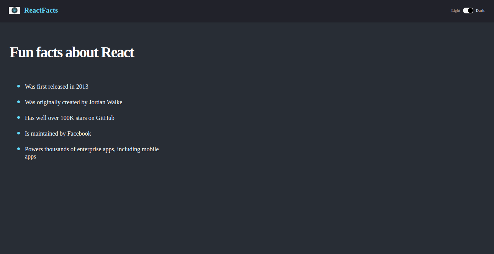

# React Facts

> A Web App built in React to tell you about some of the amazing facts of React. I hope you're into such stuff.



## Built With

- JSX, CSS
- React

# Set Up
## Clone This Repository
```
$ git clone https://github.com/emmyobonyo/react-facts-site.git
$ cd react-facts-site
```

## Run Project
```
$ npm install
$ npm start
```

## Authors

👤 **Emmanuel Obonyo**

- GitHub: [@emmyobonyo](https://github.com/emmyobonyo)
- Twitter: [@emmyobonyo](https://twitter.com/emmyobonyo)
- LinkedIn: [Emmanuel Obonyo](https://www.linkedin.com/in/emmanuel-obonyo-3728a2200/)

## 🤝 Contributing

Contributions, issues, and feature requests are welcome!

## Show your support

Give a ⭐️ if you like this project!
